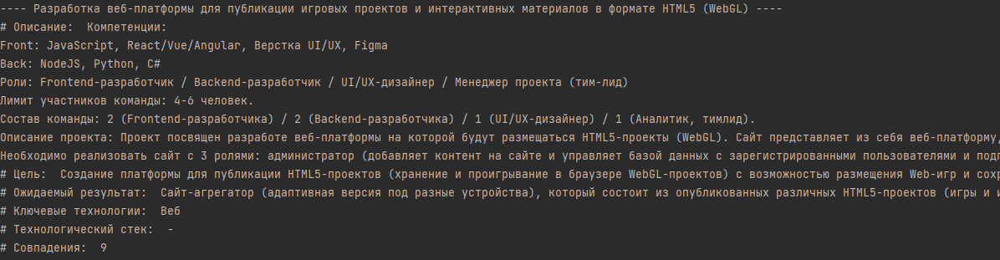
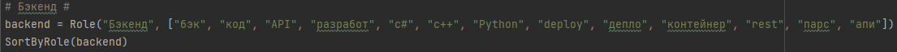

# Анализ ПроКомпетенций

     

**Сортировка по ключевым словам**       
=====================

Скрипт производит сортировку на основе найденных в информации о проекте совпадений со списком ключевых слов. 
На текущем этапе слова берутся без окончания. Такой подход повышает эффективность сортировки, т.к. выполняется поиск подстроки в строке, а не сравнение слов напрямую.
-----------------------------------
 
Для тестирования скрипта запустите функцию SortByRole, передав в неё экземпляр класса Role. В папке со скриптом должна находиться таблица с проектами, названная "data.xlsx".
-----------------------------------
 
-----------------------------------
**UPDATE:**  
Добавлена "строгая сортировка", при которой осуществляется поиск заданного слова в тексте, а не поиск заданной подстроки в каждом из слов текста.
В SortByRole добавлен флаг is_strict, определяющий, как именно будет выполняться сортировка.

